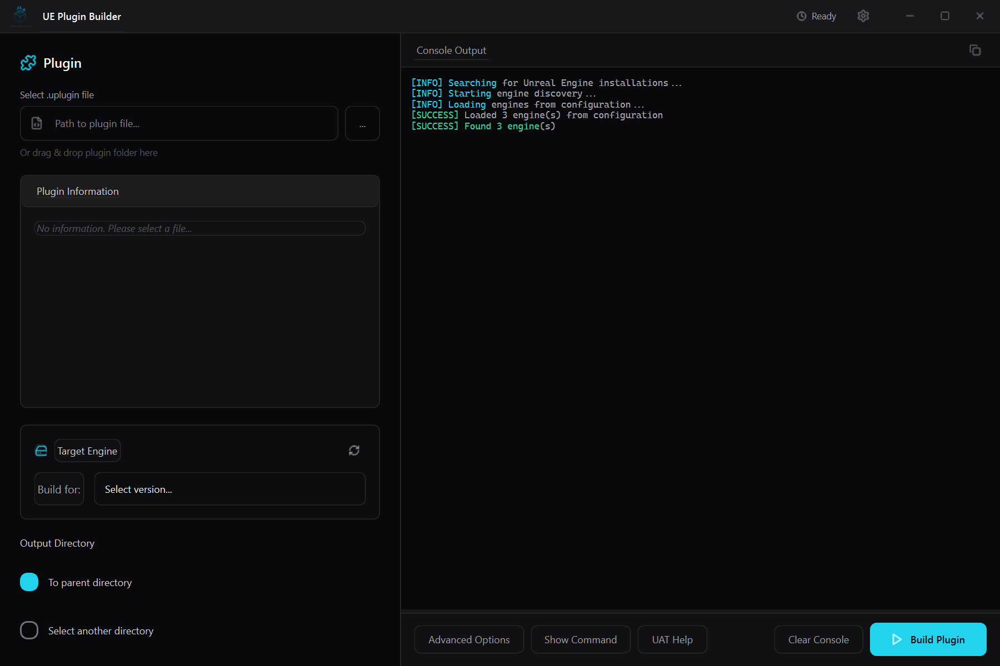
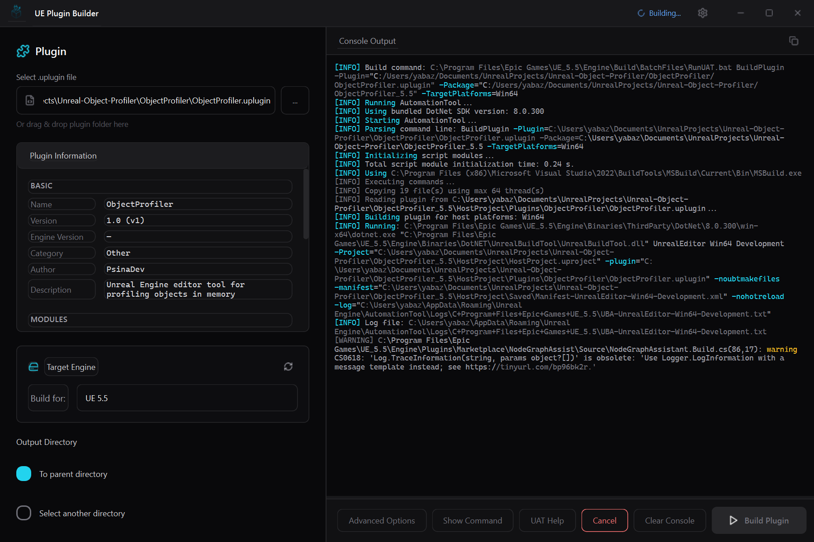
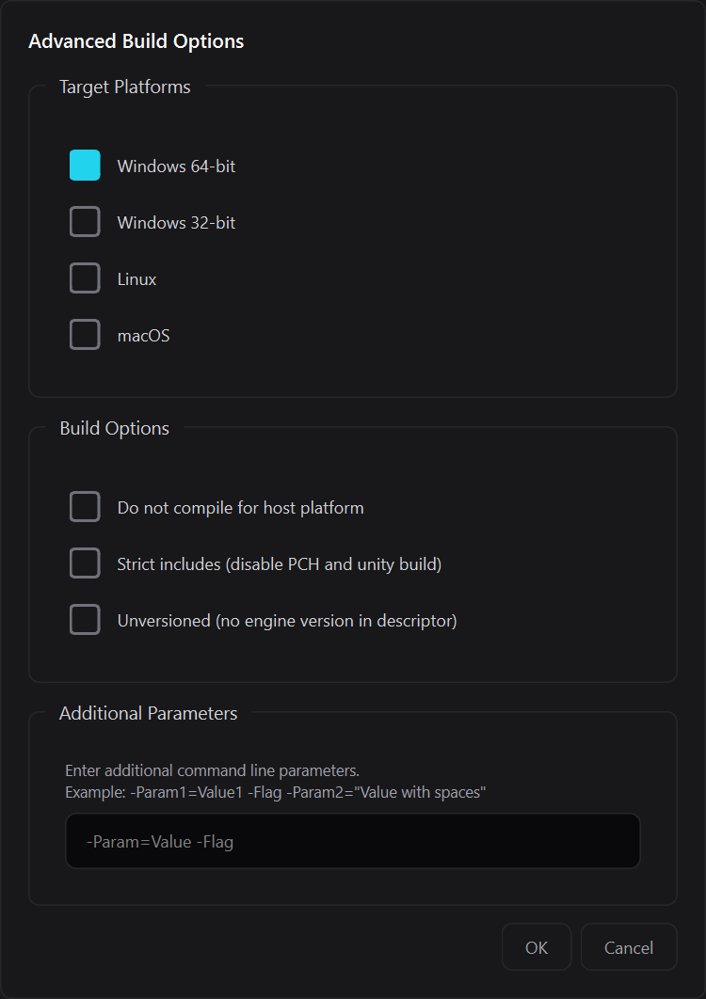
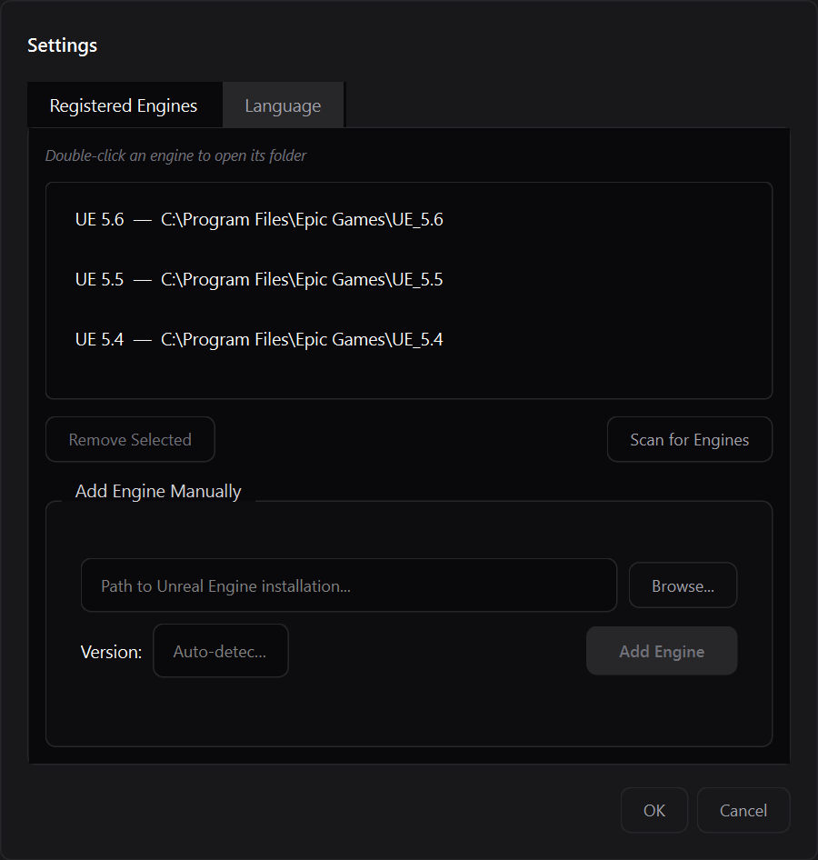
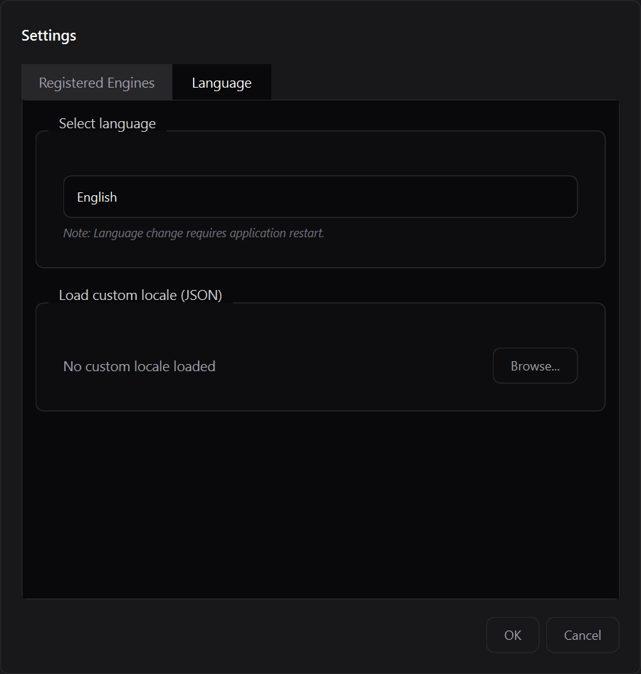

# ⚠️ Этот репозиторий в архиве

**Проект заменён на [UE Forge](https://github.com/PsinaDev/ue-forge)** — модульный десктопный тулкит для автоматизации работы с Unreal Engine.

UE Forge включает Plugin Builder вместе с дополнительными инструментами: Renamer, Include Optimizer и Commandlet Runner — всё в едином окне с сайдбаром.

### Миграция

```bash
git clone --recurse-submodules https://github.com/PsinaDev/ue-forge.git
cd ue-forge
pip install -r requirements.txt
python -m ue_forge
```

Plugin Builder доступен отдельно как `python -m ue_forge.plugin_builder`.

---

# Unreal-Engine-Plugin-Builder

Русский | **[English](README.md)**

Простой графический инструмент для пересборки плагинов UE на Windows с использованием RunUAT



## Что это?

Это небольшое десктопное приложение, которое упрощает пересборку плагинов Unreal Engine для разных версий движка. Я сделал его, чтобы упростить свой рабочий процесс при работе с несколькими версиями UE.

## Возможности

- Пересборка плагинов между разными версиями UE
- Автоматическое обнаружение установленных версий Unreal Engine (или ручное добавление)
- Настройка целевых платформ и параметров сборки
- Консоль сборки с подсветкой синтаксиса в реальном времени
- Поддержка английского и русского языков
- Тёмный интерфейс для ночных сессий кодинга

## Установка

### Быстрый старт

1. Скачайте ZIP-архив релиза
2. Распакуйте в любое место на компьютере
3. Запустите `UE Plugin Builder.exe`

Вот и всё! Установка не требуется.

### Для разработчиков

Если хотите запустить из исходников:

1. Убедитесь, что у вас есть Python 3.8+ и PySide6
2. Клонируйте репозиторий
3. Запустите `python -m source` или `python source/app.py`

## Как использовать

### Основные шаги

1. **Выберите плагин**: Найдите файл .uplugin или перетащите его в приложение
2. **Выберите целевую версию UE**: Укажите, для какой версии движка пересобрать плагин
3. **Укажите вывод**: Используйте стандартное расположение или выберите свою директорию
4. **Сборка**: Нажмите кнопку «Собрать» и следите за консолью



### Расширенные настройки

Нажмите «Дополнительно...», чтобы:
- Выбрать целевые платформы (Win64, Win32, Mac, Linux)
- Настроить параметры сборки



## Настройки


- Добавление/сканирование установок Unreal Engine


- Изменение языка интерфейса

Приложение сохраняет конфигурацию в:  
`%LOCALAPPDATA%\UEPluginBuilder\`

## Лицензия

MIT License

## Примечание

*Этот инструмент не связан с Epic Games.*
