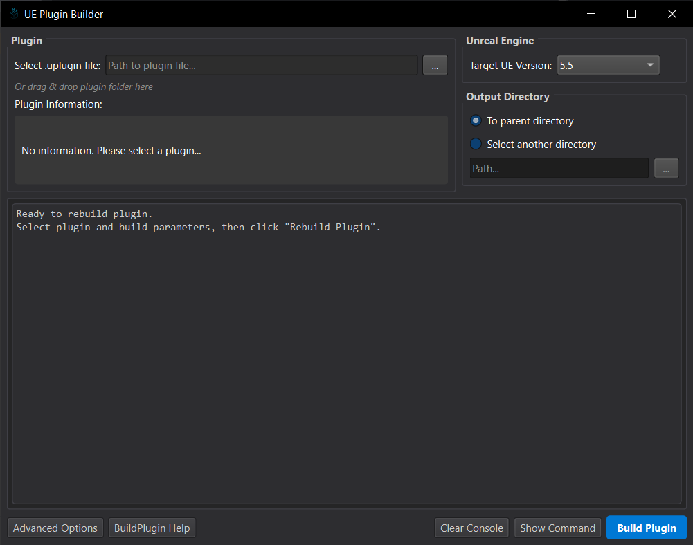
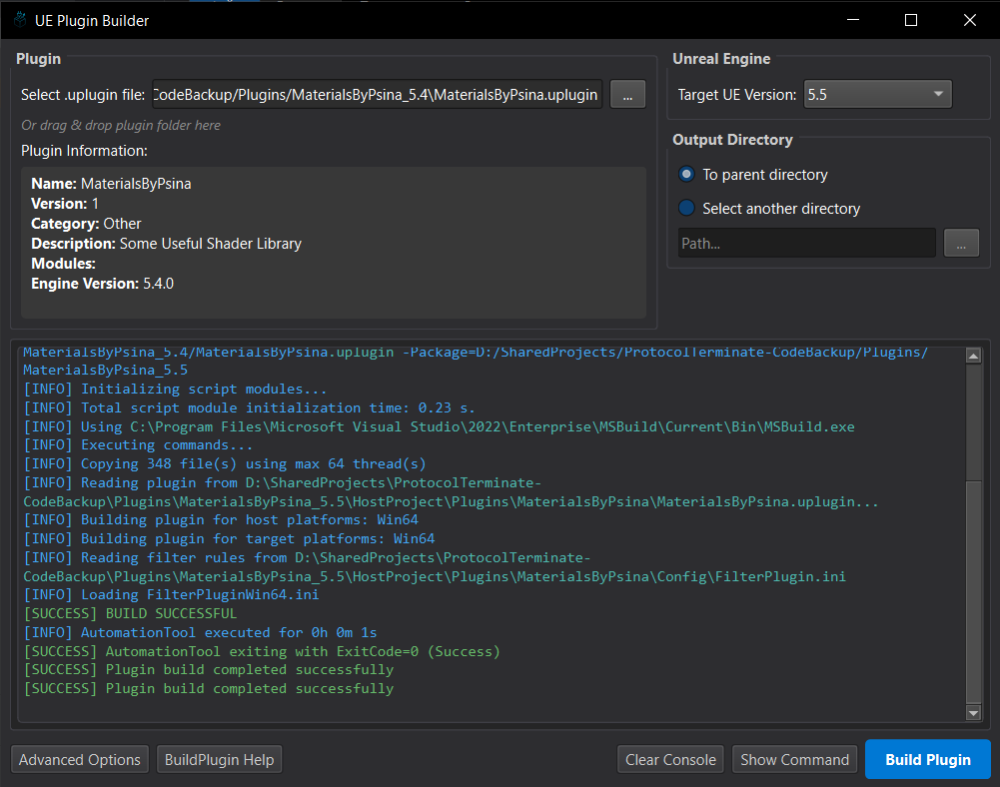
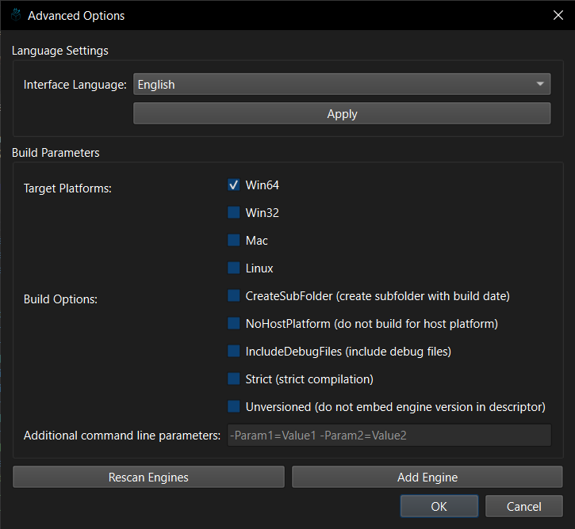

# Unreal-Engine-Plugin-Builder
A simple GUI tool for rebuilding UE plugins on Windows using RunUAT



## What is this?

This is a small desktop app that makes it easier to rebuild Unreal Engine plugins for different engine versions. I made it to simplify my own workflow when working across multiple UE versions.

## Features

- Rebuild plugins between different UE versions
- Auto-detects installed Unreal Engine versions (or add them manually)
- Configure build platforms, options, and parameters
- Real-time build console with syntax highlighting
- English and Russian language support
- Dark theme UI for late-night coding sessions

## Installation

### Quick Start

1. Download the release ZIP
2. Extract anywhere on your PC
3. Run `UEPluginBuilder.exe`

That's it! No installation needed.

### For Developers

If you want to run from source:

1. Make sure you have Python 3.8+ and PySide6
2. Clone this repo
3. Run `python main.py`

## How to Use

### Basic Steps

1. **Select your plugin**: Browse to a .uplugin file or drag-drop it into the app
2. **Choose target UE version**: Select which engine version to rebuild for
3. **Set output**: Either use default location or choose custom directory
4. **Build**: Hit the "Build Plugin" button and watch the console



### Advanced Stuff

Click "Advanced Options" to:
- Select target platforms (Win64, Win32, Mac, Linux)
- Configure build parameters
- Add/scan Unreal Engine installations
- Change interface language



## Settings

The app saves its config in:  
`%LOCALAPPDATA%\UnrealPluginRebuilder\`

## Troubleshooting

### No Engines Found?
Use "Advanced Options > Add Unreal Engine..." to manually add your UE installation.

### Build Errors?
Check the console output for error messages. Make sure your plugin is compatible with the target engine version.

### Other Issues?
Feel free to open an issue on GitHub.

## Project Structure

```
ue-plugin-builder/
├── backend/                # Backend logic
│   ├── engine_finder.py    # UE installation detection
│   └── plugin_builder.py   # Plugin build process
├── frontend/               # UI components
│   ├── advanced_options_dialog.py
│   ├── console_widget.py
│   ├── localization.py
│   ├── main_window.py
│   └── manual_engine_dialog.py
└── main.py                 # Application entry point
```

## Adding More Languages

1. Edit `localization.py` to add new language entries
2. Or manually edit `%LOCALAPPDATA%\UnrealPluginBuilder\localization_config.json`

## License

MIT License

## Note

*This tool isn't affiliated with Epic Games.*