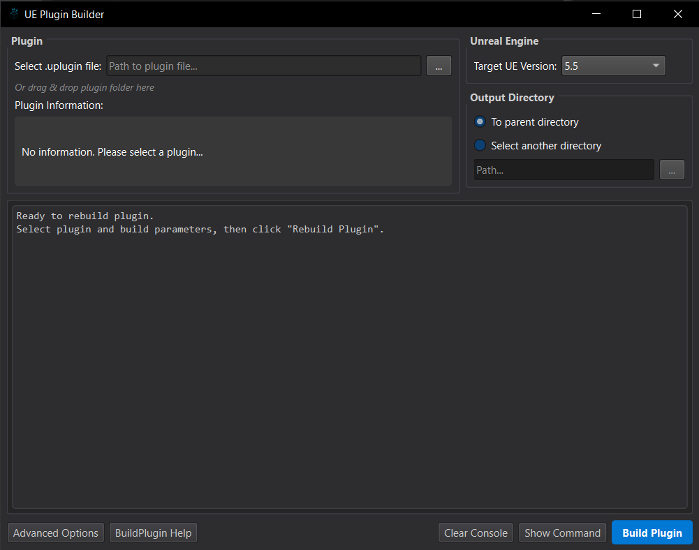
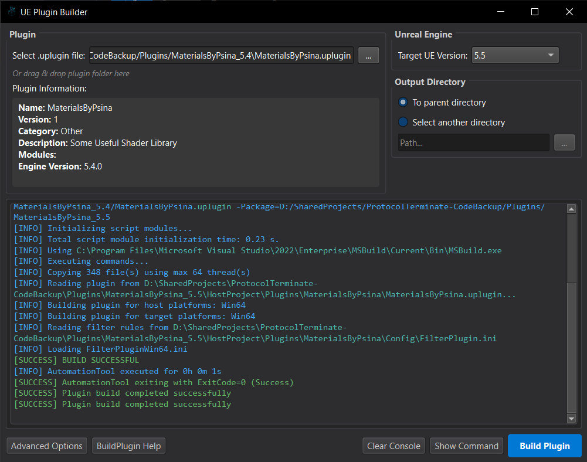
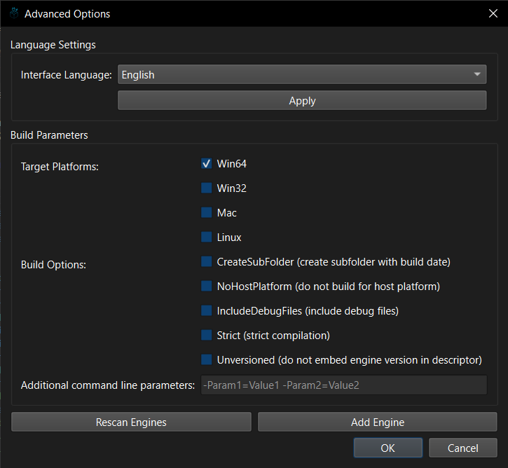

# Unreal Engine Plugin Builder

A modern, cross-platform tool for rebuilding Unreal Engine plugins to make them compatible with different engine versions.



## Features

- **Engine Version Management**: Easily rebuild plugins between different versions of Unreal Engine
- **Automated Engine Detection**: Automatically finds installed Unreal Engine versions on your system
- **Advanced Build Options**: Configure platform targets, compilation options, and other build parameters
- **Real-time Build Console**: View build progress with syntax highlighting for errors and warnings
- **Multilingual Support**: Currently supports English and Russian, with easy extensibility for other languages
- **Dark Theme**: Comfortable interface designed for long coding sessions

## Installation

### Prerequisites

- Python 3.8 or newer
- PySide6 (Qt for Python)
- Unreal Engine installation (supports UE4 and UE5)

### Setup

1. Clone this repository:
   ```
   git clone https://github.com/yourusername/ue-plugin-builder.git
   ```

2. Install required dependencies:
   ```
   pip install PySide6
   ```

3. Run the application:
   ```
   python main.py
   ```

## Usage Guide

### Basic Workflow

1. **Select Unreal Engine Versions**:
   - Choose the source UE version (the version your plugin was built for)
   - Select the target UE version (the version you want to rebuild for)

2. **Select Plugin File**:
   - Click the "..." button and navigate to your .uplugin file
   - Or drag and drop your plugin folder into the application
   - The plugin information will appear in the info panel

3. **Choose Output Directory**:
   - Use the default option to save in the parent directory with the UE version suffix
   - Or select a custom directory for the rebuilt plugin

4. **Start the Build Process**:
   - Click "Rebuild Plugin" to start
   - Monitor the process in the console window



### Advanced Options

Click "Advanced Options" to configure:

- **Target Platforms**: Select which platforms to build for (Win64, Win32, Mac, Linux)
- **Build Options**: Configure compilation parameters
- **Engine Management**: Add or rescan Unreal Engine installations
- **Language Settings**: Change the application interface language



## Command Line Usage

You can also view the command that will be executed:

1. Configure your build settings in the UI
2. Click "Show Command"
3. Copy the displayed command to run directly in your terminal

## Configuration

Settings are stored in the user's application data directory:
- Windows: `%LOCALAPPDATA%\UnrealPluginRebuilder\`
- Engine configurations: `unreal_engines_config.json`
- Localization settings: `localization_config.json`

## Troubleshooting

### Common Issues

1. **No Unreal Engine Detected**:
   - Use "Advanced Options" > "Add Unreal Engine..." to manually add your UE installation
   - Ensure the path contains a valid Unreal Engine installation

2. **Build Errors**:
   - Check the console output for specific error messages
   - Verify that the plugin is compatible with the target UE version
   - Ensure you have the necessary permissions to write to the output directory

3. **Missing Dependencies**:
   - Make sure the plugin's dependencies are available in the target engine

## Development

### Project Structure

```
ue-plugin-builder/
├── backend/                # Backend logic
│   ├── __init__.py
│   ├── engine_finder.py    # UE installation detection
│   └── plugin_builder.py   # Plugin build process
├── frontend/               # UI components
│   ├── __init__.py
│   ├── advanced_options_dialog.py
│   ├── console_widget.py
│   ├── localization.py
│   ├── main_window.py
│   ├── manual_engine_dialog.py
│   └── resources/          # Icons and resources
└── main.py                 # Application entry point
```

### Adding New Languages

#### Source:

1. Modify `localization.py` to add new language entries to the translations dictionary
2. Add UI elements for language selection in `advanced_options_dialog.py`

#### .EXE:
1. Navigate to %localappdata%
2. Find UnrealPluginBuilder
3. Add your language to ```localization_config.json```
## Contributing

Contributions are welcome! Please feel free to submit a Pull Request.

1. Fork the repository
2. Create your feature branch (`git checkout -b feature/amazing-feature`)
3. Commit your changes (`git commit -m 'Add some amazing feature'`)
4. Push to the branch (`git push origin feature/amazing-feature`)
5. Open a Pull Request

## License

This project is licensed under the MIT License - see the LICENSE file for details.

## Acknowledgments

- Unreal Engine is a trademark of Epic Games, Inc.
- Thanks to Epic Games for their BuildPlugin toolchain that makes this possible

---

*This tool is not affiliated with or endorsed by Epic Games, Inc.*
